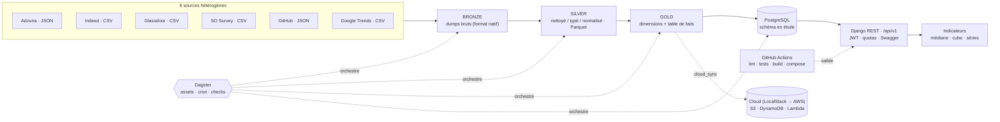
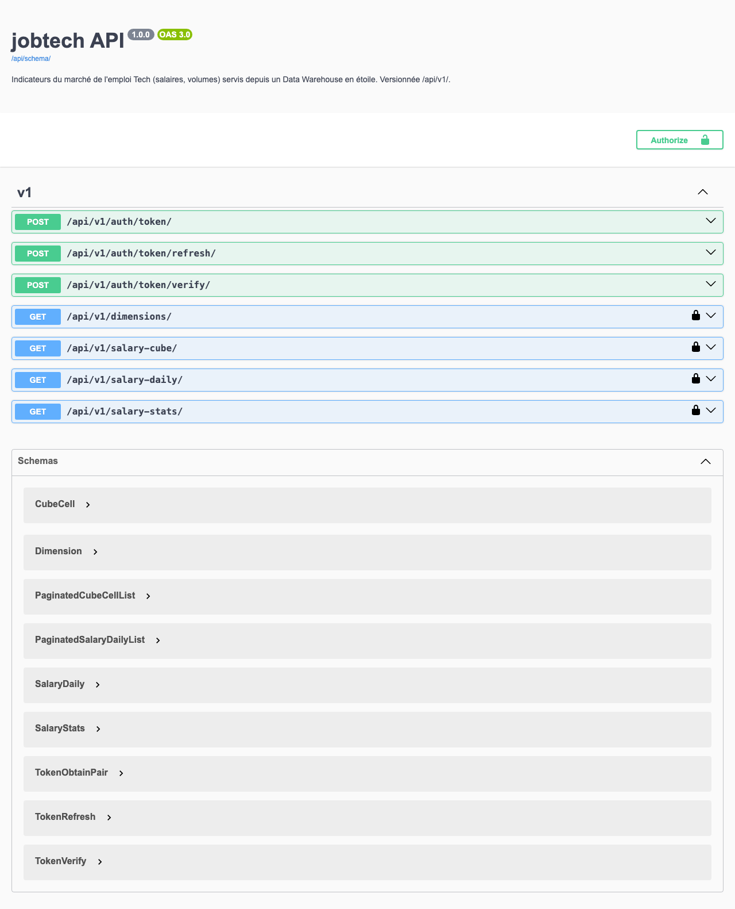
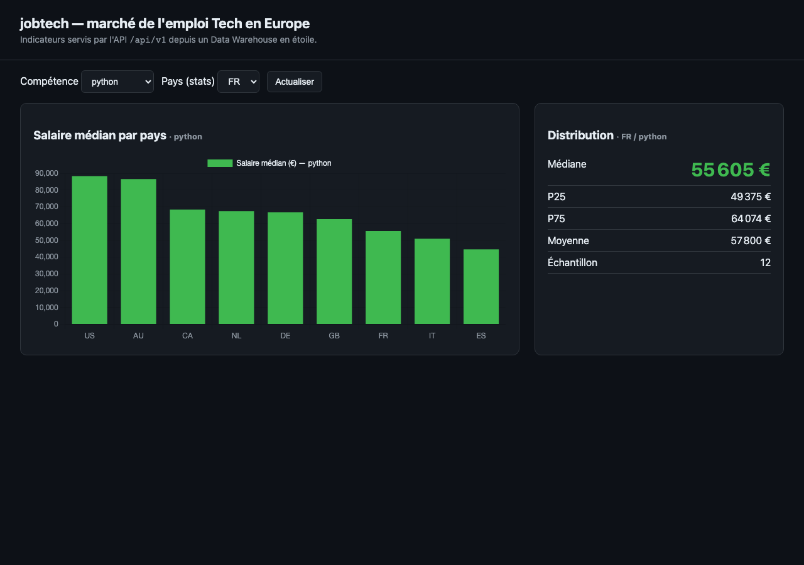

# jobtech

> Plateforme data qui cartographie le marché de l'emploi Tech en Europe — d'un
> **datalake médaillon** à une **API REST d'indicateurs**, orchestrée par Dagster,
> testée en CI et déployable dans le cloud (IaC Terraform).

jobtech ingère 6 sources hétérogènes (offres et salaires Tech), les fait passer par
un datalake **bronze → silver → gold**, les charge dans un **Data Warehouse en étoile**
(PostgreSQL), et expose des indicateurs analytiques (salaire médian, distribution, cube
multidimensionnel, volumes) via une **API Django REST Framework** versionnée et
documentée (OpenAPI/Swagger).

---

## Architecture



- **Datalake médaillon** : `bronze` (immuable, format natif) → `silver` (nettoyé/typé/
  normalisé, Parquet) → `gold` (dimensions + table de faits). Contrat de données explicite
  entre couches ; manifest de fraîcheur/volumétrie.
- **Data Warehouse en étoile** : 5 dimensions (`d_date`, `d_country`, `d_company`,
  `d_skill`, `d_source`) + table de faits `fact_job`, contraintes d'intégrité et chargement
  par **UPSERT idempotent**.
- **API REST** : endpoints analytiques (`/salary-stats/`, `/salary-cube/`, `/salary-daily/`,
  `/dimensions/`), **auth JWT**, **quotas/throttling**, **pagination**, **versioning** `/api/v1/`,
  **doc OpenAPI** (`/api/docs/`).
- **Orchestration** : Dagster (assets médaillon, ordonnanceur cron, asset checks de qualité,
  micro-batch incrémental partitionné par jour).
- **Cloud** : infrastructure-as-code Terraform (S3 chiffré KMS + lifecycle, DynamoDB, Kinesis,
  Lambda, API Gateway, IAM least-privilege), testée **local-first** via LocalStack et moto.

Détail : [docs/architecture.md](docs/architecture.md) (schémas de flux + modèle dimensionnel),
[docs/data-governance.md](docs/data-governance.md) (RGPD), [docs/adr/](docs/adr/) (décisions
d'architecture argumentées).

| Documentation API (Swagger) | Dashboard de démo |
|---|---|
|  |  |

---

## Stack technique

| Domaine | Technologies |
|---|---|
| **Langage** | Python 3.10+ |
| **Ingestion** | requests, BeautifulSoup, pytrends, Selenium *(optionnel)* |
| **Transformation** | pandas, SQLAlchemy, **Pandera** (qualité), pycountry |
| **Stockage** | **PostgreSQL** (DWH étoile), Parquet (datalake) |
| **API** | **Django REST Framework**, drf-spectacular (OpenAPI), SimpleJWT |
| **Orchestration** | **Dagster** (assets, schedules, asset checks) |
| **Cloud (IaC)** | **Terraform** (S3, KMS, DynamoDB, Kinesis, Lambda, API Gateway), LocalStack, moto |
| **CI/CD** | **GitHub Actions**, Docker, docker-compose |
| **Tests** | pytest, pytest-django, coverage (seuil 75 %) |

---

## Démarrage

### Option A — stack complète via Docker

```bash
cp .env.example .env          # renseigner les identifiants Postgres
docker compose up             # PostgreSQL + ETL + API (gunicorn)
# API → http://localhost:8000   ·   doc → http://localhost:8000/api/docs/
```

### Option B — local

```bash
python -m venv .venv && source .venv/bin/activate
pip install -r requirements.txt

cp .env.example .env          # renseigner les identifiants Postgres
docker compose up -d db       # PostgreSQL

# 1) Datalake médaillon + chargement du Data Warehouse en étoile
python -m pipeline.run all    # bronze → silver → gold → warehouse

# 2) API REST
python api/manage.py migrate  # tables Django (auth, JWT)
python api/manage.py runserver
# → http://localhost:8000   ·   doc → http://localhost:8000/api/docs/
```

Exemple d'appel :

```bash
curl "http://localhost:8000/api/v1/salary-stats/?country=FR&skill=python"
# → {"median": 55605.4, "p25": 49375.0, "p75": 64074.18, "avg": 57800.3, "sample_size": 12}
```

Orchestrateur (UI Dagster) :

```bash
dagster dev -m orchestration.definitions   # http://localhost:3000
```

Un client Python typé et un exemple exécutable sont fournis dans [examples/](examples/).

---

## Structure du projet

```
jobtech/
├── pipeline/            # ETL médaillon (sources, silver, gold, load_dw, cloud_sync, incremental)
├── orchestration/       # définitions Dagster (assets, schedules, checks)
├── api/                 # API Django REST Framework (analytics, JWT, OpenAPI)
├── sql/                 # DDL du Data Warehouse en étoile (PostgreSQL)
├── infra/               # IaC Terraform (S3, KMS, DynamoDB, Kinesis, Lambda, API GW)
├── deploy/              # kit de déploiement (compose prod, Caddy, runbook)
├── tests/               # tests unitaires, qualité de données, intégration, contrat API
├── examples/            # client API + OpenAPI + exemple exécutable
├── docs/                # architecture, gouvernance, ADR, captures
├── data/bronze/_reference_html/   # échantillon HTML brut (donnée non structurée, sans PII)
├── docker-compose.yml   # db + api + etl
└── .github/workflows/   # CI (lint, tests, build images, smoke compose)
```

---

## Tests

```bash
pytest -q --cov --cov-report=term-missing
```

La suite couvre : transformations unitaires (devises/ISO2/fourchettes de salaire),
**qualité de données** (gates Pandera silver+gold), **intégration médaillon** (bronze→silver→gold),
**idempotence du DWH** (UPSERT micro-batch sans doublon), **contrat API** (endpoints + auth 200/401),
**parité réel↔synthétique** et **pipeline cloud** (moto in-process : S3 + DynamoDB).
La CI applique un **seuil de couverture de 75 %**. *(Les tests touchant le DWH nécessitent
un PostgreSQL — fourni par `docker compose up -d db` en local et par un service Postgres en CI.)*

---

## Données de démo

Pour une démo et une CI **100 % reproductibles**, le dépôt s'appuie par défaut sur des
**données synthétiques déterministes** (seed figée) : entreprises et montants **fictifs**,
**zéro donnée personnelle**. Le générateur produit, pour chaque source, **le même schéma natif**
que l'ingestion réelle — si bien que les **mêmes transformations silver** tournent sur les deux.

Les **connecteurs d'ingestion réelle** (API Adzuna, téléchargement Stack Overflow Survey,
scraping GitHub Trending, Google Trends, …) sont implémentés dans
[`pipeline/ingest_real.py`](pipeline/ingest_real.py). Voir
[docs/adr/sources-reelles-vs-synthetiques.md](docs/adr/sources-reelles-vs-synthetiques.md).

---

## Cloud

L'infrastructure est **entièrement décrite en Terraform** ([infra/](infra/)) et validée
**local-first** : le même code cible un émulateur AWS local (**LocalStack**) ou le vrai AWS,
sans aucune dépendance émulateur dans le code. Sécurité par conception : chiffrement at-rest
(KMS) et in-transit (TLS imposé sur S3), **IAM least-privilege**, politique de rétention par
cycle de vie S3. Détail : [infra/README.md](infra/README.md).

---

## Licence

Distribué sous licence **MIT** — voir [LICENSE](LICENSE).
