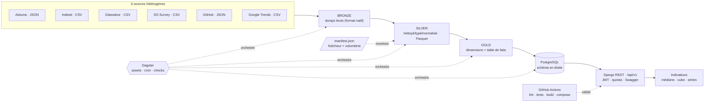
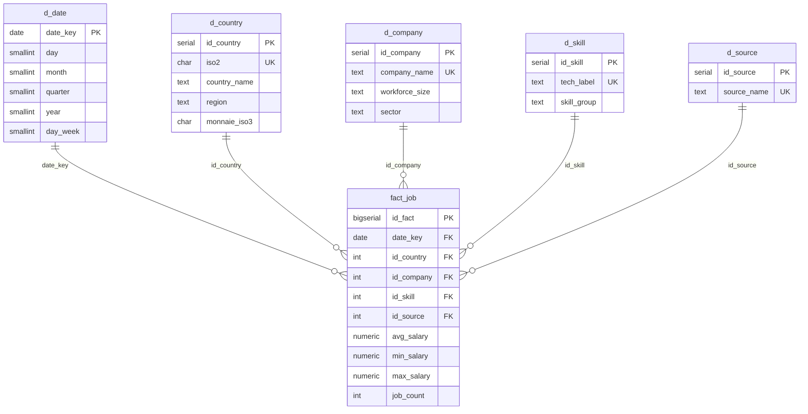
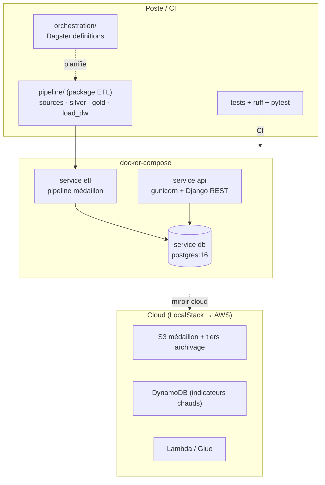
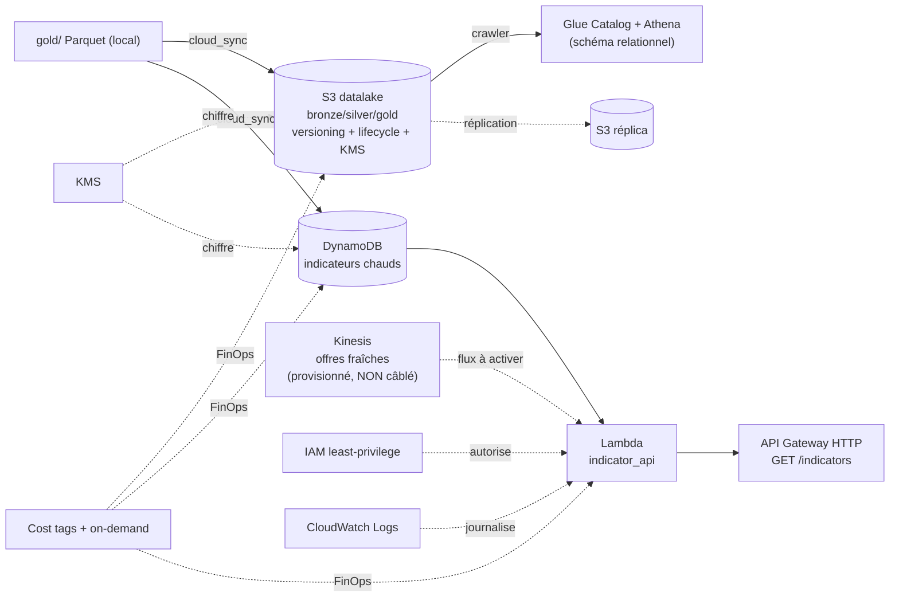

# Architecture jobtech

Plateforme data qui cartographie le marché de l'emploi Tech : datalake médaillon +
Data Warehouse en étoile (PostgreSQL) + API REST d'indicateurs, orchestrée par Dagster
et intégrée en CI, avec une couche cloud (LocalStack → AWS).

---

## 1. Flux de données (médaillon → DWH → API)

**Transformations clés (silver)** : normalisation des devises → EUR, mapping pays →
ISO2 (`pycountry`, mémoïsé), parsing de fourchettes de salaire, éclatement
multi-compétences. **Contrat de données** explicite et unique entre couches.

---

## 2. Modèle dimensionnel — schéma en étoile (MCD/MLD)

**Contraintes d'intégrité** : PK/FK sur toutes les dimensions ; `UNIQUE`
de grain `(date_key, id_country, id_company, id_skill, id_source)` permettant l'UPSERT
idempotent ; `CHECK (min_salary <= max_salary)` et `CHECK (job_count >= 0)`.
**MLD** : types PostgreSQL réels (`SERIAL`, `NUMERIC(12,2)`, `CHAR(2)`), index sur les
FK de la table de faits pour l'accès analytique.

---

## 3. Architecture technique courante

**Cible de stockage unique** : PostgreSQL (DW étoile + lecture API). **Secrets** hors
code (`django-environ` + `.env`). **Images** : `api/Dockerfile` (gunicorn) et
`Dockerfile` (ETL). **Orchestration** : Dagster (assets + cron + asset checks).
**CI** : GitHub Actions (lint, tests, exécution ETL, build images, smoke
`docker compose up`).

---

## 4. Architecture cloud + matrice de flux sécurisés

### Matrice de flux sécurisés

| Flux | Chiffrement transit | Chiffrement repos | Contrôle d'accès |
|---|---|---|---|
| client → API Gateway | TLS (HTTPS) | — | public lecture (indicateurs anonymes) |
| Lambda → DynamoDB | TLS interne AWS | KMS (table) | rôle IAM : `GetItem`/`Query` **uniquement** |
| Lambda → CloudWatch | TLS interne AWS | — | rôle IAM : `PutLogEvents` |
| cloud_sync → S3 | **TLS imposé** (policy `Deny aws:SecureTransport=false`) | SSE-KMS + bucket key | accès public entièrement bloqué |
| Kinesis → Lambda *(non câblé)* | TLS interne AWS | chiffrement Kinesis | rôle IAM : `GetRecords` **(droits prêts, flux à activer)** |
| S3 → S3 réplica | TLS interne AWS | SSE-KMS | rôle de réplication dédié |

> ⚠️ **Kinesis = primitive provisionnée, NON câblée.** Le stream et les droits IAM
> `GetRecords` existent (primitive temps réel en place), mais **aucun producteur**
> (`put_record`) ni **`event_source_mapping`** ne l'alimente encore : la Lambda est
> déclenchée par **API Gateway** (lecture DynamoDB), pas par Kinesis. Le branchement
> bout-en-bout (producteur + mapping + log) est un **axe d'amélioration**.

**Rétention RGPD** (lifecycle S3) : bronze 30 j → Glacier → expiration 90 j ; silver/gold → IA.
Détail : [data-governance.md](data-governance.md) · IaC : [`infra/`](../infra/README.md).

> État honnête (vérifié 2026-06-17) : IaC `terraform validate`-clean (lake, serving,
> pipelines, **relational** Glue/Athena) ; **`terraform apply` exécuté sur LocalStack**
> (20 ressources S3/KMS/DynamoDB/Kinesis/Lambda/IAM/API GW, bout-en-bout API GW→Lambda→
> DynamoDB **HTTP 200**) ; pipeline cloud aussi testé en CI via moto in-process.
> Restent **sur AWS réel** : apply autoritaire, **Glue/Athena** (code écrit +
> `validate`, apply réel), dashboard de coûts, réplication/lifecycle réels.
